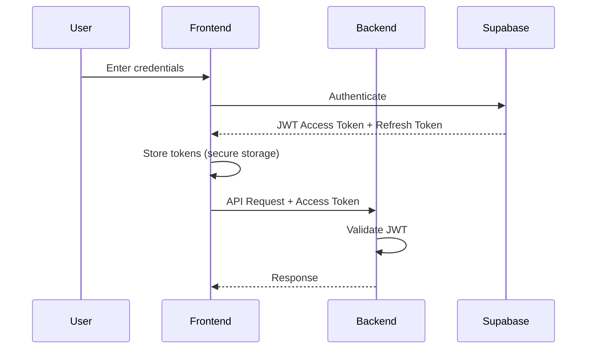

# Universo Platformo C# - Architecture Documentation

This document outlines the architecture and design decisions for the C# implementation of Universo Platformo.

<details>
<summary>In Russian</summary>

# Universo Platformo C# - Документация архитектуры

Этот документ описывает архитектуру и проектные решения для реализации Universo Platformo на C#.
</details>

## Table of Contents / Содержание

1. [Overview / Обзор](#overview--обзор)
2. [Monorepo Structure / Структура монорепозитория](#monorepo-structure--структура-монорепозитория)
3. [Package Architecture / Архитектура пакетов](#package-architecture--архитектура-пакетов)
4. [Technology Mappings / Соответствие технологий](#technology-mappings--соответствие-технологий)
5. [Authentication / Аутентификация](#authentication--аутентификация)
6. [Database Layer / Слой базы данных](#database-layer--слой-базы-данных)
7. [Frontend Architecture / Архитектура фронтенда](#frontend-architecture--архитектура-фронтенда)
8. [Backend Architecture / Архитектура бэкенда](#backend-architecture--архитектура-бэкенда)
9. [Build System / Система сборки](#build-system--система-сборки)

## Overview / Обзор

Universo Platformo C# is a C# implementation of the Universo Platformo concept, originally developed in React/TypeScript. This implementation maintains the same conceptual architecture while adapting it to the .NET ecosystem and C# best practices.

**Key Design Principles / Ключевые принципы проектирования:**

- **Type Safety**: Leverage C#'s strong typing throughout the stack
- **Modularity**: Package-based architecture with clear boundaries
- **Base Implementations**: Each package has a `base/` folder for future extensibility
- **Blazor WebAssembly**: Modern web UI framework for C#
- **ASP.NET Core**: Robust backend framework
- **Supabase Integration**: Multi-user functionality and data storage

<details>
<summary>In Russian</summary>

Universo Platformo C# - это реализация концепции Universo Platformo на C#, изначально разработанной на React/TypeScript. Эта реализация сохраняет ту же концептуальную архитектуру, адаптируя её к экосистеме .NET и лучшим практикам C#.
</details>

## Monorepo Structure / Структура монорепозитория

**CRITICAL**: Unlike the React version that uses PNPM workspaces, the C# version uses .NET's native monorepo capabilities. **ALL functionality MUST be in `packages/` directory** (see Constitution Principle I - NON-NEGOTIABLE).

```
universo-platformo-csharp/
├── src/
│   ├── packages/              # ⚠️ MANDATORY: ALL feature packages MUST be here
│   │   ├── [feature]-frt/     # Frontend packages (Blazor WebAssembly)
│   │   │   └── base/          # Primary implementation
│   │   ├── [feature]-srv/     # Backend packages (ASP.NET Core)
│   │   │   └── base/          # Primary implementation
│   │   └── [feature]-common/  # Shared contracts/DTOs (optional)
│   ├── shared/                # ⚠️ ONLY for cross-cutting infrastructure
│   │   ├── Universo.Types/    # Common types/interfaces
│   │   ├── Universo.Utils/    # Utility functions
│   │   └── Universo.I18n/     # Internationalization
│   ├── Universo.sln           # Main solution file
│   ├── Directory.Build.props  # Shared MSBuild properties
│   └── Directory.Packages.props # Centralized package versions
├── tests/
│   ├── unit/                  # Unit tests
│   ├── integration/           # Integration tests
│   └── Tests.sln              # Test solution
├── tools/
│   └── build/                 # Build scripts
├── .github/                   # GitHub configuration
├── .specify/                  # Memory and templates
├── specs/                     # Feature specifications
└── .gitignore                 # Git ignore rules
```

### What Goes Where / Что где размещается

**`packages/` Directory (MANDATORY for all features):**
- ✅ All domain features (Clusters, Metaverses, Uniks, etc.)
- ✅ Authentication packages (auth-frt, auth-srv)
- ✅ Template packages (template-quiz, template-mmoomm)
- ✅ Multiplayer infrastructure (multiplayer-colyseus-srv)
- ✅ Any feature-specific functionality

**`shared/` Directory (ONLY for infrastructure):**
- ✅ Common types and interfaces (Universo.Types)
- ✅ Utility functions (Universo.Utils)
- ✅ Internationalization (Universo.I18n)
- ✅ API client libraries (Universo.ApiClient)
- ❌ NO feature-specific logic allowed

**Root Level:**
- ✅ Solution files, build configuration
- ✅ Documentation (README, CONTRIBUTING, LICENSE)
- ✅ Configuration files (.gitignore, .editorconfig)
- ❌ NO implementation code allowed

**Rationale**: This strict separation enables future migration of individual packages to separate repositories. Packages WILL gradually move to independent repos as the project matures.

### Directory.Build.props

This file contains shared MSBuild properties for all projects:

```xml
<Project>
  <PropertyGroup>
    <LangVersion>latest</LangVersion>
    <Nullable>enable</Nullable>
    <TreatWarningsAsErrors>true</TreatWarningsAsErrors>
    <GenerateDocumentationFile>true</GenerateDocumentationFile>
  </PropertyGroup>
</Project>
```

### Directory.Packages.props

Centralizes NuGet package versions (similar to PNPM's workspace dependencies):

```xml
<Project>
  <PropertyGroup>
    <ManagePackageVersionsCentrally>true</ManagePackageVersionsCentrally>
  </PropertyGroup>
  <ItemGroup>
    <PackageVersion Include="MudBlazor" Version="7.0.0" />
    <PackageVersion Include="Supabase" Version="0.15.0" />
    <!-- Other packages... -->
  </ItemGroup>
</Project>
```

<details>
<summary>In Russian</summary>

**КРИТИЧНО**: В отличие от версии на React, использующей рабочие области PNPM, версия на C# использует нативные возможности монорепозитория .NET. **ВСЯ функциональность ДОЛЖНА быть в директории `packages/`** (см. Принцип I Конституции - НЕ ПОДЛЕЖИТ ОБСУЖДЕНИЮ).

**Что где размещается:**

**Директория `packages/` (ОБЯЗАТЕЛЬНО для всех функций):**
- ✅ Все доменные функции (Кластеры, Метавселенные, Уники и т.д.)
- ✅ Пакеты аутентификации (auth-frt, auth-srv)
- ✅ Пакеты шаблонов (template-quiz, template-mmoomm)
- ✅ Инфраструктура мультиплеера (multiplayer-colyseus-srv)
- ✅ Любая функциональность, специфичная для функции

**Директория `shared/` (ТОЛЬКО для инфраструктуры):**
- ✅ Общие типы и интерфейсы (Universo.Types)
- ✅ Вспомогательные функции (Universo.Utils)
- ✅ Интернационализация (Universo.I18n)
- ✅ Библиотеки API-клиентов (Universo.ApiClient)
- ❌ Логика, специфичная для функций, НЕ допускается

**Корневой уровень:**
- ✅ Файлы решения, конфигурация сборки
- ✅ Документация (README, CONTRIBUTING, LICENSE)
- ✅ Файлы конфигурации (.gitignore, .editorconfig)
- ❌ Код реализации НЕ допускается

**Обоснование**: Это строгое разделение позволяет в будущем мигрировать отдельные пакеты в отдельные репозитории. Пакеты БУДУТ постепенно перемещаться в независимые репозитории по мере созревания проекта.
</details>

## Package Architecture / Архитектура пакетов

Each functional area is organized as a package with separate frontend and backend projects:

```
packages/
├── clusters-frt/              # Clusters frontend
│   └── base/
│       ├── Universo.Clusters.Frontend.csproj
│       ├── Pages/
│       ├── Components/
│       ├── Services/
│       └── Models/
├── clusters-srv/              # Clusters backend
│   └── base/
│       ├── Universo.Clusters.Backend.csproj
│       ├── Controllers/
│       ├── Services/
│       ├── Repositories/
│       └── Models/
```

### Package Naming Convention / Соглашение об именовании пакетов

- **Frontend packages**: `<feature>-frt` (e.g., `clusters-frt`)
- **Backend packages**: `<feature>-srv` (e.g., `clusters-srv`)
- **Project names**: `Universo.<Feature>.<Type>` (e.g., `Universo.Clusters.Frontend`)

### Base Folder Pattern / Паттерн папки Base

Each package has a `base/` folder containing the primary implementation. This allows for:

- Multiple implementations in the future (e.g., `base/`, `alternative/`)
- Clear separation of different implementation strategies
- Easy swapping of implementations

<details>
<summary>In Russian</summary>

Каждая функциональная область организована как пакет с отдельными проектами фронтенда и бэкенда. Каждый пакет имеет папку `base/`, содержащую основную реализацию, что позволяет иметь несколько реализаций в будущем.
</details>

## Technology Mappings / Соответствие технологий

Mapping from React version to C# version:

| React Version | C# Version | Purpose |
|---------------|------------|---------|
| PNPM Workspaces | .NET Solution + Directory.*.props | Monorepo management |
| npm packages | NuGet packages | Package management |
| TypeScript | C# | Programming language |
| React | Blazor WebAssembly | Frontend framework |
| Express.js | ASP.NET Core | Backend framework |
| Passport.js | ASP.NET Core Identity | Authentication |
| Material-UI (MUI) | MudBlazor | UI component library |
| React Router | Blazor Router | Routing |
| Redux/Zustand | Fluxor | State management |
| Axios | HttpClient | HTTP client |
| TypeORM | Entity Framework Core | ORM |
| Jest/Vitest | xUnit | Testing framework |
| ESLint | .editorconfig + Roslyn | Code style |

<details>
<summary>In Russian</summary>

| Версия на React | Версия на C# | Назначение |
|-----------------|--------------|------------|
| PNPM Workspaces | Решение .NET + Directory.*.props | Управление монорепозиторием |
| npm пакеты | NuGet пакеты | Управление пакетами |
| TypeScript | C# | Язык программирования |
| React | Blazor WebAssembly | Фреймворк фронтенда |
| Express.js | ASP.NET Core | Фреймворк бэкенда |
</details>

## Authentication / Аутентификация

### Supabase Integration / Интеграция с Supabase

The C# version uses the Supabase C# client library for authentication:

```csharp
public class SupabaseAuthService : IAuthService
{
    private readonly Supabase.Client _client;
    
    public SupabaseAuthService(IConfiguration configuration)
    {
        var url = configuration["Supabase:Url"];
        var key = configuration["Supabase:AnonKey"];
        
        _client = new Supabase.Client(url, key);
    }
    
    public async Task<AuthResponse> SignInAsync(string email, string password)
    {
        return await _client.Auth.SignIn(email, password);
    }
}
```

### ASP.NET Core Identity Integration / Интеграция с ASP.NET Core Identity

For additional authentication features, we integrate ASP.NET Core Identity with Supabase:

```csharp
services.AddAuthentication(JwtBearerDefaults.AuthenticationScheme)
    .AddJwtBearer(options =>
    {
        options.TokenValidationParameters = new TokenValidationParameters
        {
            ValidateIssuer = true,
            ValidateAudience = true,
            ValidateLifetime = true,
            ValidateIssuerSigningKey = true,
            ValidIssuer = configuration["Supabase:JwtIssuer"],
            ValidAudience = configuration["Supabase:JwtAudience"],
            IssuerSigningKey = new SymmetricSecurityKey(
                Encoding.UTF8.GetBytes(configuration["Supabase:JwtSecret"]))
        };
    });
```

<details>
<summary>In Russian</summary>

Версия на C# использует клиентскую библиотеку Supabase для C# для аутентификации, интегрированную с ASP.NET Core Identity для дополнительных возможностей аутентификации.
</details>

## Database Layer / Слой базы данных

### Entity Framework Core

We use Entity Framework Core as the ORM, configured to work with Supabase's PostgreSQL database:

```csharp
public class UniversoDbContext : DbContext
{
    public DbSet<Cluster> Clusters { get; set; }
    public DbSet<Domain> Domains { get; set; }
    public DbSet<Resource> Resources { get; set; }
    
    protected override void OnModelCreating(ModelBuilder modelBuilder)
    {
        modelBuilder.Entity<Cluster>()
            .HasMany(c => c.Domains)
            .WithOne(d => d.Cluster)
            .HasForeignKey(d => d.ClusterId);
            
        // Additional configuration...
    }
}
```

### Repository Pattern / Паттерн репозитория

Each entity has a repository for data access:

```csharp
public interface IClusterRepository
{
    Task<Cluster?> GetByIdAsync(Guid id);
    Task<IEnumerable<Cluster>> GetAllAsync();
    Task<Cluster> CreateAsync(Cluster cluster);
    Task UpdateAsync(Cluster cluster);
    Task DeleteAsync(Guid id);
}

public class ClusterRepository : IClusterRepository
{
    private readonly UniversoDbContext _context;
    
    public ClusterRepository(UniversoDbContext context)
    {
        _context = context;
    }
    
    // Implementation...
}
```

<details>
<summary>In Russian</summary>

Мы используем Entity Framework Core в качестве ORM, настроенный для работы с базой данных PostgreSQL от Supabase. Каждая сущность имеет репозиторий для доступа к данным.
</details>

## Frontend Architecture / Архитектура фронтенда

### Blazor WebAssembly

Frontend is built with Blazor WebAssembly, which runs .NET in the browser:

```razor
@page "/clusters"
@inject IClusterService ClusterService

<MudContainer>
    <MudText Typo="Typo.h4">Clusters</MudText>
    
    @if (clusters == null)
    {
        <MudProgressCircular Indeterminate="true" />
    }
    else
    {
        <MudTable Items="@clusters">
            <HeaderContent>
                <MudTh>Name</MudTh>
                <MudTh>Description</MudTh>
            </HeaderContent>
            <RowTemplate>
                <MudTd>@context.Name</MudTd>
                <MudTd>@context.Description</MudTd>
            </RowTemplate>
        </MudTable>
    }
</MudContainer>

@code {
    private List<Cluster>? clusters;
    
    protected override async Task OnInitializedAsync()
    {
        clusters = await ClusterService.GetClustersAsync();
    }
}
```

### MudBlazor Components / Компоненты MudBlazor

MudBlazor provides Material Design components for Blazor:

- `MudTable` - Data tables
- `MudDialog` - Dialogs and modals
- `MudButton` - Buttons
- `MudTextField` - Input fields
- And many more...

### State Management / Управление состоянием

For state management, we use Fluxor (Redux pattern for Blazor):

```csharp
public record ClusterState
{
    public List<Cluster> Clusters { get; init; } = new();
    public bool IsLoading { get; init; }
}

public class LoadClustersAction { }

public class LoadClustersSuccessAction
{
    public List<Cluster> Clusters { get; }
    public LoadClustersSuccessAction(List<Cluster> clusters)
    {
        Clusters = clusters;
    }
}

[FeatureState]
public class ClusterFeature : Feature<ClusterState>
{
    public override string GetName() => "Clusters";
    protected override ClusterState GetInitialState() => new();
}
```

<details>
<summary>In Russian</summary>

Фронтенд построен на Blazor WebAssembly, который запускает .NET в браузере. MudBlazor предоставляет компоненты Material Design. Для управления состоянием используется Fluxor.
</details>

## Backend Architecture / Архитектура бэкенда

### ASP.NET Core

Backend uses ASP.NET Core with minimal API or controller-based approach:

```csharp
[ApiController]
[Route("api/[controller]")]
[Authorize]
public class ClustersController : ControllerBase
{
    private readonly IClusterService _clusterService;
    private readonly ILogger<ClustersController> _logger;
    
    public ClustersController(
        IClusterService clusterService,
        ILogger<ClustersController> logger)
    {
        _clusterService = clusterService;
        _logger = logger;
    }
    
    [HttpGet]
    public async Task<ActionResult<List<Cluster>>> GetClusters()
    {
        _logger.LogInformation("Getting all clusters");
        var clusters = await _clusterService.GetClustersAsync();
        return Ok(clusters);
    }
    
    [HttpGet("{id}")]
    public async Task<ActionResult<Cluster>> GetCluster(Guid id)
    {
        var cluster = await _clusterService.GetClusterAsync(id);
        
        if (cluster == null)
            return NotFound();
            
        return Ok(cluster);
    }
    
    [HttpPost]
    public async Task<ActionResult<Cluster>> CreateCluster(CreateClusterRequest request)
    {
        var cluster = await _clusterService.CreateClusterAsync(request);
        return CreatedAtAction(nameof(GetCluster), new { id = cluster.Id }, cluster);
    }
}
```

### Service Layer / Слой сервисов

Business logic is encapsulated in service classes:

```csharp
public interface IClusterService
{
    Task<List<Cluster>> GetClustersAsync();
    Task<Cluster?> GetClusterAsync(Guid id);
    Task<Cluster> CreateClusterAsync(CreateClusterRequest request);
    Task UpdateClusterAsync(Guid id, UpdateClusterRequest request);
    Task DeleteClusterAsync(Guid id);
}

public class ClusterService : IClusterService
{
    private readonly IClusterRepository _repository;
    private readonly IMapper _mapper;
    private readonly ILogger<ClusterService> _logger;
    
    public ClusterService(
        IClusterRepository repository,
        IMapper mapper,
        ILogger<ClusterService> logger)
    {
        _repository = repository;
        _mapper = mapper;
        _logger = logger;
    }
    
    // Implementation...
}
```

### Dependency Injection / Внедрение зависимостей

Services are registered in `Program.cs`:

```csharp
builder.Services.AddScoped<IClusterRepository, ClusterRepository>();
builder.Services.AddScoped<IClusterService, ClusterService>();
builder.Services.AddDbContext<UniversoDbContext>(options =>
    options.UseNpgsql(builder.Configuration.GetConnectionString("Supabase")));
```

<details>
<summary>In Russian</summary>

Бэкенд использует ASP.NET Core с контроллерами. Бизнес-логика инкапсулирована в классах сервисов. Сервисы регистрируются через внедрение зависимостей.
</details>

## Build System / Система сборки

### MSBuild

Projects are built using MSBuild:

```bash
# Build entire solution
dotnet build

# Build specific project
dotnet build src/packages/clusters-frt/base

# Clean build
dotnet clean && dotnet build

# Publish for deployment
dotnet publish -c Release -o publish/
```

### Build Targets / Цели сборки

Custom build targets can be defined in `.csproj` files:

```xml
<Target Name="CustomBuildTask" BeforeTargets="Build">
  <Message Text="Running custom build task" Importance="high" />
</Target>
```

### CI/CD Integration / Интеграция CI/CD

GitHub Actions workflow for building and testing:

```yaml
name: Build and Test

on: [push, pull_request]

jobs:
  build:
    runs-on: ubuntu-latest
    steps:
      - uses: actions/checkout@v3
      - uses: actions/setup-dotnet@v3
        with:
          dotnet-version: '9.0.x'
      - run: dotnet restore
      - run: dotnet build --no-restore
      - run: dotnet test --no-build
```

<details>
<summary>In Russian</summary>

Проекты собираются с помощью MSBuild. Пользовательские цели сборки можно определить в файлах `.csproj`. CI/CD интегрируется через GitHub Actions.
</details>

## Development Workflow / Рабочий процесс разработки

1. **Clone repository / Клонировать репозиторий**
2. **Install .NET SDK / Установить .NET SDK**
3. **Restore packages / Восстановить пакеты**: `dotnet restore`
4. **Build solution / Собрать решение**: `dotnet build`
5. **Run tests / Запустить тесты**: `dotnet test`
6. **Start backend / Запустить бэкенд**: `dotnet run --project src/packages/main-srv/base`
7. **Start frontend / Запустить фронтенд**: `dotnet run --project src/packages/main-frt/base`

<details>
<summary>In Russian</summary>

Рабочий процесс разработки включает клонирование репозитория, установку .NET SDK, восстановление пакетов, сборку решения, запуск тестов и запуск приложения.
</details>

## Best Practices / Лучшие практики

1. **Use dependency injection / Использовать внедрение зависимостей**
2. **Follow SOLID principles / Следовать принципам SOLID**
3. **Write unit tests / Писать юнит-тесты**
4. **Document public APIs / Документировать публичные API**
5. **Use async/await / Использовать async/await**
6. **Handle exceptions properly / Правильно обрабатывать исключения**
7. **Use nullable reference types / Использовать nullable reference types**
8. **Follow C# naming conventions / Следовать соглашениям об именовании C#**

## Database Architecture / Архитектура базы данных

This section provides comprehensive database architecture planning for Universo Platformo C#.

### Database Strategy / Стратегия базы данных

**Primary Database**: PostgreSQL via Supabase  
**ORM**: Entity Framework Core  
**Migration Strategy**: Code-First with EF Core Migrations

<details>
<summary>In Russian</summary>

**Основная база данных**: PostgreSQL через Supabase  
**ORM**: Entity Framework Core  
**Стратегия миграций**: Code-First с миграциями EF Core
</details>

### Core Schema Design / Проектирование основной схемы

#### User Management Schema / Схема управления пользователями

```sql
-- Users table (managed by Supabase Auth)
-- We reference auth.users(id) from our tables

-- User profiles (extended user information)
CREATE TABLE user_profiles (
    id UUID PRIMARY KEY REFERENCES auth.users(id) ON DELETE CASCADE,
    display_name VARCHAR(255),
    avatar_url TEXT,
    bio TEXT,
    language VARCHAR(10) DEFAULT 'en',
    theme VARCHAR(20) DEFAULT 'light',
    created_at TIMESTAMP WITH TIME ZONE DEFAULT NOW(),
    updated_at TIMESTAMP WITH TIME ZONE DEFAULT NOW()
);

-- User preferences
CREATE TABLE user_preferences (
    id UUID PRIMARY KEY DEFAULT gen_random_uuid(),
    user_id UUID REFERENCES auth.users(id) ON DELETE CASCADE,
    preference_key VARCHAR(100) NOT NULL,
    preference_value TEXT,
    created_at TIMESTAMP WITH TIME ZONE DEFAULT NOW(),
    updated_at TIMESTAMP WITH TIME ZONE DEFAULT NOW(),
    UNIQUE(user_id, preference_key)
);

CREATE INDEX idx_user_preferences_user_id ON user_preferences(user_id);
```

#### Audit Trail Schema / Схема аудита

```sql
-- Audit log for tracking all data changes
CREATE TABLE audit_logs (
    id UUID PRIMARY KEY DEFAULT gen_random_uuid(),
    table_name VARCHAR(100) NOT NULL,
    record_id UUID NOT NULL,
    action VARCHAR(20) NOT NULL, -- INSERT, UPDATE, DELETE
    old_data JSONB,
    new_data JSONB,
    changed_by UUID REFERENCES auth.users(id),
    changed_at TIMESTAMP WITH TIME ZONE DEFAULT NOW(),
    ip_address INET,
    user_agent TEXT
);

CREATE INDEX idx_audit_logs_table_record ON audit_logs(table_name, record_id);
CREATE INDEX idx_audit_logs_changed_by ON audit_logs(changed_by);
CREATE INDEX idx_audit_logs_changed_at ON audit_logs(changed_at DESC);
```

#### Base Entity Pattern / Паттерн базовой сущности

All entities follow this pattern:

```csharp
public abstract class BaseEntity
{
    public Guid Id { get; set; }
    public DateTime CreatedAt { get; set; }
    public DateTime UpdatedAt { get; set; }
    public Guid? CreatedBy { get; set; }
    public Guid? UpdatedBy { get; set; }
    public bool IsDeleted { get; set; } // Soft delete
    public DateTime? DeletedAt { get; set; }
}
```

<details>
<summary>In Russian</summary>

Все сущности следуют этому базовому паттерну с полями для аудита, временных меток и мягкого удаления.
</details>

### Multi-Database Abstraction Strategy / Стратегия абстракции множественных баз данных

To support future databases (PostgreSQL direct, SQL Server, MySQL), we use the Repository pattern with database provider abstraction.

#### Repository Interfaces / Интерфейсы репозиториев

```csharp
public interface IRepository<T> where T : BaseEntity
{
    Task<T?> GetByIdAsync(Guid id, CancellationToken cancellationToken = default);
    Task<IEnumerable<T>> GetAllAsync(CancellationToken cancellationToken = default);
    Task<T> AddAsync(T entity, CancellationToken cancellationToken = default);
    Task<T> UpdateAsync(T entity, CancellationToken cancellationToken = default);
    Task DeleteAsync(Guid id, CancellationToken cancellationToken = default);
    IQueryable<T> Query(); // For complex queries
}

public interface IUnitOfWork : IDisposable
{
    Task<int> SaveChangesAsync(CancellationToken cancellationToken = default);
    Task BeginTransactionAsync(CancellationToken cancellationToken = default);
    Task CommitTransactionAsync(CancellationToken cancellationToken = default);
    Task RollbackTransactionAsync(CancellationToken cancellationToken = default);
}
```

#### Database Provider Configuration / Конфигурация провайдера базы данных

```csharp
// appsettings.json
{
  "Database": {
    "Provider": "Supabase", // Options: Supabase, PostgreSQL, SqlServer, MySQL
    "ConnectionString": "...",
    "EnableSensitiveDataLogging": false,
    "CommandTimeout": 30
  }
}

// Startup configuration
services.AddDbContext<UniversoDbContext>(options =>
{
    var provider = configuration["Database:Provider"];
    var connectionString = configuration["Database:ConnectionString"];
    
    switch (provider)
    {
        case "Supabase":
        case "PostgreSQL":
            options.UseNpgsql(connectionString);
            break;
        case "SqlServer":
            options.UseSqlServer(connectionString);
            break;
        case "MySQL":
            options.UseMySql(connectionString, ServerVersion.AutoDetect(connectionString));
            break;
        default:
            throw new InvalidOperationException($"Unsupported database provider: {provider}");
    }
});
```

<details>
<summary>In Russian</summary>

Стратегия абстракции использует паттерн Repository и Unit of Work для поддержки множественных баз данных. Провайдер базы данных настраивается через конфигурацию.
</details>

### Index Strategy / Стратегия индексов

For optimal performance, we create indexes on:

1. **Foreign Keys**: All foreign key columns
2. **Search Fields**: Text fields used in search (name, description)
3. **Filter Fields**: Fields commonly used in WHERE clauses
4. **Sort Fields**: Fields used in ORDER BY
5. **Composite Indexes**: For common multi-column queries

Example:
```sql
-- Composite index for common query pattern
CREATE INDEX idx_clusters_user_created ON clusters(created_by, created_at DESC);

-- Full-text search index
CREATE INDEX idx_clusters_search ON clusters USING GIN(to_tsvector('english', name || ' ' || COALESCE(description, '')));
```

<details>
<summary>In Russian</summary>

Стратегия индексов оптимизирует производительность для внешних ключей, полей поиска, фильтрации, сортировки и составных индексов для общих шаблонов запросов.
</details>

### Migration Strategy / Стратегия миграций

**Approach**: Code-First with EF Core Migrations

```bash
# Create new migration
dotnet ef migrations add MigrationName --project src/packages/database-srv/base

# Apply migrations
dotnet ef database update --project src/packages/database-srv/base

# Generate SQL script
dotnet ef migrations script --project src/packages/database-srv/base --output migration.sql
```

**Migration Guidelines**:
1. Never delete migrations that have been applied to production
2. Use separate migrations for schema changes vs data migrations
3. Test migrations on a copy of production data
4. Always generate and review SQL scripts before production deployment
5. Maintain backwards compatibility during rolling deployments

<details>
<summary>In Russian</summary>

Подход Code-First с миграциями EF Core. Руководства включают сохранение примененных миграций, разделение схемы и данных, тестирование на копии продакшн данных, проверку SQL скриптов и обеспечение обратной совместимости.
</details>

## Session Management Architecture / Архитектура управления сеансами

### Authentication Flow / Поток аутентификации



### Token Management / Управление токенами

**Access Token**:
- Short-lived (15 minutes default)
- Stored in memory (JavaScript closure)
- Included in Authorization header: `Bearer {token}`
- Contains user claims (id, email, role)

**Refresh Token**:
- Long-lived (7 days default)
- Stored in HttpOnly cookie (not accessible to JavaScript)
- Used to obtain new access tokens
- Rotated on each use (refresh token rotation)

```csharp
// Token configuration
services.Configure<JwtOptions>(options =>
{
    options.AccessTokenExpiration = TimeSpan.FromMinutes(15);
    options.RefreshTokenExpiration = TimeSpan.FromDays(7);
    options.Issuer = "Universo Platformo";
    options.Audience = "Universo API";
    options.SecretKey = configuration["Jwt:SecretKey"];
});
```

<details>
<summary>In Russian</summary>

Токены доступа короткоживущие (15 минут), хранятся в памяти. Токены обновления долгоживущие (7 дней), хранятся в HttpOnly cookie и ротируются при каждом использовании.
</details>

### Session Lifecycle / Жизненный цикл сеанса

1. **Login**: User authenticates, receives tokens
2. **Active Session**: Access token used for API requests
3. **Token Refresh**: Before expiration, refresh token obtains new access token
4. **Idle Timeout**: After 30 minutes of inactivity, require re-authentication
5. **Absolute Timeout**: After 7 days, require re-authentication regardless of activity
6. **Logout**: Invalidate refresh token, clear client-side tokens

```csharp
public class SessionService
{
    private readonly TimeSpan _idleTimeout = TimeSpan.FromMinutes(30);
    private readonly TimeSpan _absoluteTimeout = TimeSpan.FromDays(7);
    
    public async Task<bool> IsSessionValidAsync(string userId)
    {
        var session = await _sessionRepository.GetByUserIdAsync(userId);
        
        if (session == null) return false;
        
        // Check absolute timeout
        if (DateTime.UtcNow - session.CreatedAt > _absoluteTimeout)
            return false;
        
        // Check idle timeout
        if (DateTime.UtcNow - session.LastActivity > _idleTimeout)
            return false;
        
        return true;
    }
}
```

### Concurrent Session Handling / Обработка одновременных сеансов

**Strategy**: Allow multiple concurrent sessions per user (max 5)

```sql
CREATE TABLE user_sessions (
    id UUID PRIMARY KEY DEFAULT gen_random_uuid(),
    user_id UUID REFERENCES auth.users(id) ON DELETE CASCADE,
    refresh_token_hash VARCHAR(255) NOT NULL,
    device_info JSONB, -- Browser, OS, device type
    ip_address INET,
    created_at TIMESTAMP WITH TIME ZONE DEFAULT NOW(),
    last_activity TIMESTAMP WITH TIME ZONE DEFAULT NOW(),
    expires_at TIMESTAMP WITH TIME ZONE NOT NULL
);

CREATE INDEX idx_user_sessions_user_id ON user_sessions(user_id);
CREATE INDEX idx_user_sessions_expires ON user_sessions(expires_at);
```

When user logs in on 6th device, automatically invalidate oldest session.

<details>
<summary>In Russian</summary>

Стратегия позволяет до 5 одновременных сеансов на пользователя. При входе на 6-е устройство автоматически аннулируется самый старый сеанс.
</details>

### Security Considerations / Соображения безопасности

1. **Token Storage**: 
   - Access tokens: In-memory only, never localStorage
   - Refresh tokens: HttpOnly cookies with Secure flag
   
2. **CSRF Protection**: Use double-submit cookie pattern or SameSite=Strict

3. **Token Rotation**: Refresh tokens are rotated on every use

4. **Logout**: 
   - Client-side: Clear all tokens
   - Server-side: Invalidate refresh token in database

5. **Session Hijacking Prevention**:
   - Bind session to IP address (optional, configurable)
   - Track device fingerprint
   - Detect suspicious activity patterns

<details>
<summary>In Russian</summary>

Меры безопасности включают правильное хранение токенов, защиту от CSRF, ротацию токенов, правильный выход и предотвращение перехвата сеанса.
</details>

## UI Theme Configuration / Конфигурация темы UI

### MudBlazor Theme System / Система тем MudBlazor

```csharp
// Program.cs or Startup.cs
services.AddMudServices(config =>
{
    config.SnackbarConfiguration.PositionClass = Defaults.Classes.Position.BottomRight;
    config.SnackbarConfiguration.PreventDuplicates = false;
    config.SnackbarConfiguration.NewestOnTop = true;
    config.SnackbarConfiguration.ShowCloseIcon = true;
    config.SnackbarConfiguration.VisibleStateDuration = 5000;
});
```

### Color Palette / Цветовая палитра

```csharp
private MudTheme _universoTheme = new MudTheme()
{
    Palette = new PaletteLight()
    {
        Primary = "#6366F1",        // Indigo - Main brand color
        Secondary = "#EC4899",      // Pink - Accent color
        Success = "#10B981",        // Green
        Info = "#3B82F6",          // Blue
        Warning = "#F59E0B",       // Amber
        Error = "#EF4444",         // Red
        Dark = "#1F2937",          // Gray 800
        TextPrimary = "#111827",   // Gray 900
        TextSecondary = "#6B7280", // Gray 500
        Background = "#FFFFFF",
        Surface = "#F9FAFB",       // Gray 50
        AppbarBackground = "#FFFFFF",
        DrawerBackground = "#FFFFFF",
    },
    PaletteDark = new PaletteDark()
    {
        Primary = "#818CF8",       // Lighter indigo for dark mode
        Secondary = "#F472B6",     // Lighter pink
        Success = "#34D399",
        Info = "#60A5FA",
        Warning = "#FBBF24",
        Error = "#F87171",
        Dark = "#F9FAFB",
        TextPrimary = "#F9FAFB",   // Light text on dark
        TextSecondary = "#D1D5DB",
        Background = "#111827",    // Dark background
        Surface = "#1F2937",       // Lighter dark for surfaces
        AppbarBackground = "#1F2937",
        DrawerBackground = "#1F2937",
    }
};
```

### Typography Standards / Стандарты типографики

```csharp
_universoTheme.Typography = new Typography()
{
    Default = new Default()
    {
        FontFamily = new[] { "Inter", "Roboto", "Helvetica", "Arial", "sans-serif" },
        FontSize = "0.875rem",
        FontWeight = 400,
        LineHeight = 1.43,
        LetterSpacing = "0.01071em"
    },
    H1 = new H1()
    {
        FontFamily = new[] { "Inter", "Roboto", "Helvetica", "Arial", "sans-serif" },
        FontSize = "2.5rem",
        FontWeight = 700,
        LineHeight = 1.2,
        LetterSpacing = "-0.01562em"
    },
    H2 = new H2()
    {
        FontSize = "2rem",
        FontWeight = 600,
        LineHeight = 1.3,
    },
    // ... other headings
    Button = new Button()
    {
        FontSize = "0.875rem",
        FontWeight = 500,
        LineHeight = 1.75,
        LetterSpacing = "0.02857em",
        TextTransform = "none" // Don't uppercase buttons
    }
};
```

### Spacing System / Система отступов

Using MudBlazor's spacing scale (based on 8px grid):

- `xs`: 4px (0.25rem)
- `sm`: 8px (0.5rem)
- `md`: 16px (1rem)
- `lg`: 24px (1.5rem)
- `xl`: 32px (2rem)
- `xxl`: 48px (3rem)

<details>
<summary>In Russian</summary>

Система отступов основана на сетке 8px с предопределенными размерами от 4px до 48px.
</details>

### Responsive Breakpoints / Точки останова адаптивного дизайна

```csharp
// MudBlazor breakpoints
// xs: 0px
// sm: 600px
// md: 960px
// lg: 1280px
// xl: 1920px

// Usage in components
<MudHidden Breakpoint="Breakpoint.MdAndDown">
    <MudText>Visible on large screens only</MudText>
</MudHidden>
```

### Dark Mode Support / Поддержка темного режима

```csharp
// Theme toggle service
public class ThemeService
{
    private bool _isDarkMode;
    public bool IsDarkMode 
    { 
        get => _isDarkMode; 
        set 
        { 
            _isDarkMode = value;
            OnThemeChanged?.Invoke(value);
        } 
    }
    
    public event Action<bool>? OnThemeChanged;
    
    public async Task ToggleThemeAsync()
    {
        IsDarkMode = !IsDarkMode;
        // Save preference to user settings
        await SaveUserPreferenceAsync("theme", IsDarkMode ? "dark" : "light");
    }
}
```

### Icon Set / Набор иконок

**Primary**: Material Design Icons (included with MudBlazor)

```html
<MudIcon Icon="@Icons.Material.Filled.Dashboard" />
<MudIcon Icon="@Icons.Material.Filled.Settings" />
<MudIcon Icon="@Icons.Material.Outlined.Favorite" />
```

**Custom Icons**: Can be added via CSS or SVG

<details>
<summary>In Russian</summary>

Используются иконки Material Design, включенные в MudBlazor. Пользовательские иконки могут быть добавлены через CSS или SVG.
</details>

## Layout Components Architecture / Архитектура компонентов макета

### Main Layout Structure / Структура основного макета

```
MainLayout
├── MudLayout
    ├── MudAppBar (Header)
    │   ├── Logo
    │   ├── Navigation Menu
    │   ├── Search Bar
    │   └── User Menu
    ├── MudDrawer (Sidebar - conditional)
    │   ├── Navigation Links
    │   └── Quick Actions
    ├── MudMainContent
    │   ├── Breadcrumbs
    │   ├── @Body (Page Content)
    │   └── Footer (conditional)
    └── MudSnackbarProvider (Notifications)
```

### Layout Component Specifications / Спецификации компонентов макета

#### 1. App Bar / Верхняя панель

```csharp
<MudAppBar Elevation="1" Color="Color.Default" Fixed="true">
    <MudIconButton Icon="@Icons.Material.Filled.Menu" 
                   Color="Color.Inherit" 
                   Edge="Edge.Start" 
                   OnClick="@ToggleDrawer" />
    
    <MudImage Src="logo.svg" Height="32" Alt="Universo Platformo" Class="mr-4" />
    
    <MudSpacer />
    
    <MudTextField @bind-Value="_searchQuery" 
                  Placeholder="Search..." 
                  Adornment="Adornment.Start" 
                  AdornmentIcon="@Icons.Material.Filled.Search" 
                  Class="mr-4" />
    
    <MudIconButton Icon="@Icons.Material.Filled.Notifications" 
                   Color="Color.Inherit" />
    
    <MudMenu Icon="@Icons.Material.Filled.AccountCircle" 
             Color="Color.Inherit">
        <MudMenuItem Icon="@Icons.Material.Filled.Person">Profile</MudMenuItem>
        <MudMenuItem Icon="@Icons.Material.Filled.Settings">Settings</MudMenuItem>
        <MudDivider />
        <MudMenuItem Icon="@Icons.Material.Filled.Logout">Logout</MudMenuItem>
    </MudMenu>
</MudAppBar>
```

**Responsive Behavior**:
- `xs-md`: Hide search, show search icon button
- `md+`: Show full search bar
- Menu always collapses to hamburger icon on `xs-sm`

<details>
<summary>In Russian</summary>

Верхняя панель содержит логотип, меню навигации, поиск и меню пользователя. Адаптивное поведение изменяет компоненты в зависимости от размера экрана.
</details>

#### 2. Sidebar / Боковая панель

```csharp
<MudDrawer @bind-Open="_drawerOpen" 
           Elevation="1" 
           Variant="@DrawerVariant.Responsive"
           BreakpointWidth="Breakpoint.Md">
    <MudDrawerHeader>
        <MudText Typo="Typo.h6">Navigation</MudText>
    </MudDrawerHeader>
    <MudNavMenu>
        <MudNavLink Href="/" Icon="@Icons.Material.Filled.Dashboard">Dashboard</MudNavLink>
        <MudNavGroup Title="Clusters" Icon="@Icons.Material.Filled.Layers" Expanded="true">
            <MudNavLink Href="/clusters">All Clusters</MudNavLink>
            <MudNavLink Href="/clusters/new">New Cluster</MudNavLink>
        </MudNavGroup>
        <MudNavGroup Title="Metaverses" Icon="@Icons.Material.Filled.Public">
            <MudNavLink Href="/metaverses">All Metaverses</MudNavLink>
        </MudNavGroup>
        <!-- More navigation items -->
    </MudNavMenu>
</MudDrawer>
```

**Drawer Variants**:
- **Temporary**: Overlay on small screens, closes on selection
- **Responsive**: Permanent on large screens, temporary on small
- **Persistent**: Can be toggled, doesn't overlay content

<details>
<summary>In Russian</summary>

Боковая панель использует адаптивный вариант, который постоянно отображается на больших экранах и временно на маленьких. Поддерживает группировку навигационных элементов.
</details>

#### 3. Breadcrumbs / Хлебные крошки

```csharp
<MudBreadcrumbs Items="_breadcrumbItems" Separator=">">
    <ItemTemplate Context="item">
        <MudLink Href="@item.Href">@item.Text</MudLink>
    </ItemTemplate>
</MudBreadcrumbs>

@code {
    private List<BreadcrumbItem> _breadcrumbItems = new()
    {
        new BreadcrumbItem("Home", href: "/"),
        new BreadcrumbItem("Clusters", href: "/clusters"),
        new BreadcrumbItem("My Cluster", href: null, disabled: true)
    };
}
```

#### 4. Modal and Dialog Patterns / Паттерны модальных окон и диалогов

```csharp
// Confirmation dialog
var result = await DialogService.ShowMessageBox(
    "Delete Cluster",
    "Are you sure you want to delete this cluster? This action cannot be undone.",
    yesText: "Delete",
    cancelText: "Cancel",
    options: new DialogOptions { CloseButton = true, MaxWidth = MaxWidth.Small });

if (result == true)
{
    await DeleteClusterAsync();
}

// Custom dialog
var parameters = new DialogParameters 
{ 
    ["Cluster"] = cluster 
};

var dialog = await DialogService.ShowAsync<EditClusterDialog>("Edit Cluster", parameters);
var dialogResult = await dialog.Result;

if (!dialogResult.Canceled)
{
    var updatedCluster = (Cluster)dialogResult.Data;
    // Process updated cluster
}
```

<details>
<summary>In Russian</summary>

Паттерны модальных окон включают простые диалоги подтверждения и пользовательские диалоги с параметрами. Результаты обрабатываются через async/await.
</details>

#### 5. Toast Notification System / Система уведомлений

```csharp
// Success notification
Snackbar.Add("Cluster created successfully", Severity.Success);

// Error notification
Snackbar.Add("Failed to save changes", Severity.Error);

// Warning with action
Snackbar.Add("Connection lost. Retrying...", Severity.Warning, config =>
{
    config.Action = "Retry";
    config.ActionColor = Color.Warning;
    config.Onclick = snackbar => RetryConnection();
});
```

**Toast Configuration**:
- Position: Bottom-right
- Duration: 5 seconds (error: 10 seconds)
- Max visible: 3
- Allow dismiss: Yes (X button)

<details>
<summary>In Russian</summary>

Система уведомлений поддерживает различные типы (успех, ошибка, предупреждение, информация) с настраиваемыми действиями и длительностью отображения.
</details>

#### 6. Loading States / Состояния загрузки

```csharp
// Full page loading
@if (_isLoading)
{
    <MudOverlay Visible="true" DarkBackground="true">
        <MudProgressCircular Color="Color.Primary" Size="Size.Large" Indeterminate="true" />
    </MudOverlay>
}

// Inline loading
<MudButton Variant="Variant.Filled" 
           Color="Color.Primary" 
           Disabled="@_isSubmitting"
           OnClick="Submit">
    @if (_isSubmitting)
    {
        <MudProgressCircular Size="Size.Small" Indeterminate="true" Class="mr-2" />
    }
    Save
</MudButton>

// Skeleton screens
<MudSkeleton SkeletonType="SkeletonType.Rectangle" Height="200px" />
<MudSkeleton SkeletonType="SkeletonType.Text" />
<MudSkeleton SkeletonType="SkeletonType.Circle" Width="40px" Height="40px" />
```

<details>
<summary>In Russian</summary>

Состояния загрузки включают полноэкранные оверлеи, встроенные индикаторы в кнопках и скелетоны для контента. Это улучшает воспринимаемую производительность.
</details>

### Page Layout Patterns / Паттерны макетов страниц

#### List Page Layout / Макет страницы списка

```
┌─────────────────────────────────────────┐
│ Breadcrumbs                             │
├─────────────────────────────────────────┤
│ Page Title                  [+ New]     │
├─────────────────────────────────────────┤
│ Search Bar    [Filters]    [Sort]       │
├─────────────────────────────────────────┤
│ ┌───────────────────────────────────┐   │
│ │ List Item 1                       │   │
│ └───────────────────────────────────┘   │
│ ┌───────────────────────────────────┐   │
│ │ List Item 2                       │   │
│ └───────────────────────────────────┘   │
│                                         │
│ [< Previous] [1] [2] [3] [Next >]       │
└─────────────────────────────────────────┘
```

#### Detail Page Layout / Макет страницы деталей

```
┌─────────────────────────────────────────┐
│ Breadcrumbs                             │
├─────────────────────────────────────────┤
│ Back Arrow  Title         [Edit] [Del]  │
├─────────────────────────────────────────┤
│ ┌─────────────┬─────────────────────┐   │
│ │   Sidebar   │  Main Content       │   │
│ │   (Tabs)    │                     │   │
│ │             │                     │   │
│ │  Overview   │  [Content here]     │   │
│ │  Details    │                     │   │
│ │  History    │                     │   │
│ └─────────────┴─────────────────────┘   │
└─────────────────────────────────────────┘
```

<details>
<summary>In Russian</summary>

Стандартизированные паттерны макетов для страниц списков (с фильтрами, сортировкой, пагинацией) и страниц деталей (с боковой панелью навигации по вкладкам).
</details>

## Internationalization Implementation / Реализация интернационализации

### Resource File Structure / Структура файлов ресурсов

We use .NET's built-in resource system (.resx files):

```
Universo.I18n/
├── Resources/
│   ├── Common.resx                 (English - default)
│   ├── Common.ru.resx              (Russian)
│   ├── Validation.resx
│   ├── Validation.ru.resx
│   ├── Errors.resx
│   ├── Errors.ru.resx
│   └── Features/
│       ├── Clusters.resx
│       ├── Clusters.ru.resx
│       ├── Metaverses.resx
│       └── Metaverses.ru.resx
```

### Localization Service / Сервис локализации

```csharp
// IStringLocalizer usage
@inject IStringLocalizer<Common> Localizer

<MudText>@Localizer["Welcome"]</MudText>
<MudText>@Localizer["ItemCount", count]</MudText> // With parameters

// In C# code
public class ClusterService
{
    private readonly IStringLocalizer<Clusters> _localizer;
    
    public ClusterService(IStringLocalizer<Clusters> localizer)
    {
        _localizer = localizer;
    }
    
    public string GetClusterStatusText(ClusterStatus status)
    {
        return _localizer[$"Status_{status}"];
    }
}
```

### Language Switching / Переключение языка

```csharp
public class LanguageService
{
    private string _currentLanguage = "en";
    public string CurrentLanguage => _currentLanguage;
    
    public event Action? OnLanguageChanged;
    
    public async Task SetLanguageAsync(string language)
    {
        if (language != _currentLanguage)
        {
            _currentLanguage = language;
            
            // Set culture for current request
            CultureInfo culture = new CultureInfo(language);
            CultureInfo.CurrentCulture = culture;
            CultureInfo.CurrentUICulture = culture;
            
            // Save to user preferences
            await SaveUserPreferenceAsync("language", language);
            
            // Notify components
            OnLanguageChanged?.Invoke();
        }
    }
}
```

### Date/Time Formatting / Форматирование даты/времени

```csharp
// Using culture-aware formatting
@inject IStringLocalizer<Common> L

<MudText>@DateTime.Now.ToString("d")  // Short date pattern</MudText>
<MudText>@DateTime.Now.ToString("f")  // Full date/time pattern</MudText>
<MudText>@amount.ToString("C")        // Currency</MudText>
<MudText>@number.ToString("N2")       // Number with 2 decimals</MudText>

// Custom formatting with culture
var culture = CultureInfo.CurrentCulture;
var formattedDate = date.ToString("D", culture); // Long date pattern
```

### Number Formatting / Форматирование чисел

Numbers automatically format according to current culture:
- English (en): 1,234.56
- Russian (ru): 1 234,56

```csharp
@number.ToString("N", CultureInfo.CurrentCulture)
```

### Translation Workflow / Рабочий процесс перевода

1. **Development**: Write strings in English .resx files
2. **Extract**: Use tooling to identify missing translations
3. **Translate**: Fill in Russian .resx files with identical keys
4. **Verify**: Ensure all keys exist in both languages
5. **Test**: Switch languages in UI to verify all strings display

<details>
<summary>In Russian</summary>

Рабочий процесс перевода включает написание строк на английском, извлечение недостающих переводов, заполнение русских файлов ресурсов, проверку и тестирование переключения языков.
</details>

## C# Technology Stack Best Practices / Лучшие практики технологического стека C#

This section documents C#-specific best practices for implementing backend and frontend packages and their interaction patterns. These practices are based on industry standards and complement the React project patterns documented in `REACT_PROJECT_ANALYSIS.md`.

<details>
<summary>In Russian</summary>

Этот раздел документирует лучшие практики, специфичные для C#, для реализации пакетов бэкенда и фронтенда и паттернов их взаимодействия. Эти практики основаны на отраслевых стандартах и дополняют паттерны проекта React, задокументированные в `REACT_PROJECT_ANALYSIS.md`.
</details>

### API Communication Patterns / Паттерны взаимодействия с API

#### Typed HttpClient Services / Типизированные сервисы HttpClient

**CRITICAL**: Always use dependency injection for HttpClient. Never manually instantiate HttpClient instances to avoid socket exhaustion.

**Frontend Pattern** (in `packages/*-frt/base/`):

```csharp
// 1. Define service interface
public interface IClusterApiService
{
    Task<List<ClusterDto>> GetClustersAsync();
    Task<ClusterDto?> GetClusterAsync(Guid id);
    Task<ClusterDto> CreateClusterAsync(CreateClusterRequest request);
    Task UpdateClusterAsync(Guid id, UpdateClusterRequest request);
    Task DeleteClusterAsync(Guid id);
}

// 2. Implement typed client service
public class ClusterApiService : IClusterApiService
{
    private readonly HttpClient _httpClient;
    private readonly ILogger<ClusterApiService> _logger;
    
    public ClusterApiService(HttpClient httpClient, ILogger<ClusterApiService> logger)
    {
        _httpClient = httpClient;
        _logger = logger;
    }
    
    public async Task<List<ClusterDto>> GetClustersAsync()
    {
        try
        {
            var clusters = await _httpClient.GetFromJsonAsync<List<ClusterDto>>("api/clusters");
            return clusters ?? new List<ClusterDto>();
        }
        catch (HttpRequestException ex)
        {
            _logger.LogError(ex, "Failed to fetch clusters");
            throw;
        }
    }
    
    public async Task<ClusterDto> CreateClusterAsync(CreateClusterRequest request)
    {
        var response = await _httpClient.PostAsJsonAsync("api/clusters", request);
        response.EnsureSuccessStatusCode();
        return await response.Content.ReadFromJsonAsync<ClusterDto>()
            ?? throw new InvalidOperationException("Failed to deserialize response");
    }
}

// 3. Register in Program.cs (Blazor WASM)
builder.Services.AddHttpClient<IClusterApiService, ClusterApiService>(client =>
{
    client.BaseAddress = new Uri(builder.Configuration["ApiUrl"] ?? builder.HostEnvironment.BaseAddress);
    client.Timeout = TimeSpan.FromSeconds(30);
});

// 4. Inject service into components
@inject IClusterApiService ClusterApi

@code {
    private List<ClusterDto> clusters = new();
    
    protected override async Task OnInitializedAsync()
    {
        clusters = await ClusterApi.GetClustersAsync();
    }
}
```

**Backend Pattern** (in `packages/*-srv/base/`):

```csharp
// Controllers use service layer, not direct repository access
[ApiController]
[Route("api/[controller]")]
[Authorize]
public class ClustersController : ControllerBase
{
    private readonly IClusterService _clusterService;
    private readonly ILogger<ClustersController> _logger;
    
    public ClustersController(
        IClusterService clusterService,
        ILogger<ClustersController> logger)
    {
        _clusterService = clusterService;
        _logger = logger;
    }
    
    [HttpGet]
    [ProducesResponseType(StatusCodes.Status200OK)]
    [ProducesResponseType(StatusCodes.Status401Unauthorized)]
    public async Task<ActionResult<List<ClusterDto>>> GetClusters()
    {
        var clusters = await _clusterService.GetClustersAsync();
        return Ok(clusters);
    }
    
    [HttpGet("{id}")]
    [ProducesResponseType(StatusCodes.Status200OK)]
    [ProducesResponseType(StatusCodes.Status404NotFound)]
    public async Task<ActionResult<ClusterDto>> GetCluster(Guid id)
    {
        var cluster = await _clusterService.GetClusterAsync(id);
        return cluster != null ? Ok(cluster) : NotFound();
    }
}
```

<details>
<summary>In Russian</summary>

**КРИТИЧНО**: Всегда используйте внедрение зависимостей для HttpClient. Никогда не создавайте экземпляры HttpClient вручную, чтобы избежать исчерпания сокетов.

Типизированные клиентские сервисы инкапсулируют логику взаимодействия с API в выделенных сервисах, что улучшает тестируемость, разделение ответственности и поддерживаемость.
</details>

#### Shared Contract Libraries / Библиотеки общих контрактов

Create shared package for DTOs used by both frontend and backend:

```
src/shared/Universo.Contracts/
├── Clusters/
│   ├── ClusterDto.cs
│   ├── CreateClusterRequest.cs
│   └── UpdateClusterRequest.cs
├── Metaverses/
│   ├── MetaverseDto.cs
│   └── ...
└── Common/
    ├── PagedResult.cs
    └── ErrorResponse.cs
```

```csharp
// Example DTO
public record ClusterDto
{
    public Guid Id { get; init; }
    public string Name { get; init; } = string.Empty;
    public string? Description { get; init; }
    public DateTime CreatedAt { get; init; }
    public DateTime UpdatedAt { get; init; }
    public int DomainsCount { get; init; }
    public int ResourcesCount { get; init; }
}

// Request DTOs with validation attributes
public record CreateClusterRequest
{
    [Required]
    [StringLength(100, MinimumLength = 3)]
    public string Name { get; init; } = string.Empty;
    
    [StringLength(500)]
    public string? Description { get; init; }
}
```

<details>
<summary>In Russian</summary>

Создайте общий пакет для DTO, используемых как фронтендом, так и бэкендом. Это обеспечивает типобезопасность, устраняет дублирование кода и предотвращает ошибки сериализации.
</details>

### Error Handling Implementation / Реализация обработки ошибок

#### Global Exception Middleware / Глобальное middleware для обработки исключений

**Backend Implementation** (Constitution Principle XI):

```csharp
// 1. Define custom exception middleware
public class GlobalExceptionHandlingMiddleware
{
    private readonly RequestDelegate _next;
    private readonly ILogger<GlobalExceptionHandlingMiddleware> _logger;
    
    public GlobalExceptionHandlingMiddleware(
        RequestDelegate next,
        ILogger<GlobalExceptionHandlingMiddleware> logger)
    {
        _next = next;
        _logger = logger;
    }
    
    public async Task InvokeAsync(HttpContext context)
    {
        try
        {
            await _next(context);
        }
        catch (Exception ex)
        {
            await HandleExceptionAsync(context, ex);
        }
    }
    
    private async Task HandleExceptionAsync(HttpContext context, Exception exception)
    {
        _logger.LogError(exception, "Unhandled exception occurred");
        
        var (statusCode, title, detail) = exception switch
        {
            NotFoundException => (StatusCodes.Status404NotFound, "Not Found", exception.Message),
            ValidationException => (StatusCodes.Status400BadRequest, "Validation Error", exception.Message),
            UnauthorizedAccessException => (StatusCodes.Status401Unauthorized, "Unauthorized", "Access denied"),
            _ => (StatusCodes.Status500InternalServerError, "Internal Server Error", 
                  "An unexpected error occurred")
        };
        
        var problemDetails = new ProblemDetails
        {
            Status = statusCode,
            Title = title,
            Detail = detail,
            Instance = context.Request.Path
        };
        
        // Don't expose internal details in production
        if (context.RequestServices.GetRequiredService<IWebHostEnvironment>().IsProduction())
        {
            problemDetails.Detail = statusCode == StatusCodes.Status500InternalServerError
                ? "An error occurred while processing your request"
                : detail;
        }
        
        context.Response.StatusCode = statusCode;
        context.Response.ContentType = "application/problem+json";
        await context.Response.WriteAsJsonAsync(problemDetails);
    }
}

// 2. Custom exception types
public class NotFoundException : Exception
{
    public NotFoundException(string message) : base(message) { }
    public NotFoundException(string entityName, object key) 
        : base($"{entityName} with id {key} was not found") { }
}

public class ValidationException : Exception
{
    public ValidationException(string message) : base(message) { }
    public ValidationException(Dictionary<string, string[]> errors) 
        : base("One or more validation errors occurred")
    {
        Errors = errors;
    }
    
    public Dictionary<string, string[]>? Errors { get; }
}

// 3. Register middleware in Program.cs (early in pipeline)
app.UseMiddleware<GlobalExceptionHandlingMiddleware>();
```

**Frontend Error Handling**:

```csharp
// Blazor error boundary in layout
<ErrorBoundary>
    <ChildContent>
        @Body
    </ChildContent>
    <ErrorContent Context="exception">
        <MudAlert Severity="Severity.Error">
            <MudText>An error occurred:</MudText>
            <MudText Typo="Typo.caption">@exception.Message</MudText>
        </MudAlert>
    </ErrorContent>
</ErrorBoundary>

// Service-level error handling
public class ClusterApiService : IClusterApiService
{
    private readonly HttpClient _httpClient;
    private readonly ISnackbar _snackbar;
    
    public async Task<ClusterDto> CreateClusterAsync(CreateClusterRequest request)
    {
        try
        {
            var response = await _httpClient.PostAsJsonAsync("api/clusters", request);
            
            if (!response.IsSuccessStatusCode)
            {
                var problemDetails = await response.Content
                    .ReadFromJsonAsync<ProblemDetails>();
                _snackbar.Add(problemDetails?.Detail ?? "Failed to create cluster", 
                    Severity.Error);
                throw new HttpRequestException(problemDetails?.Detail);
            }
            
            return await response.Content.ReadFromJsonAsync<ClusterDto>()
                ?? throw new InvalidOperationException();
        }
        catch (HttpRequestException ex)
        {
            _snackbar.Add($"Network error: {ex.Message}", Severity.Error);
            throw;
        }
    }
}
```

<details>
<summary>In Russian</summary>

Глобальное middleware для обработки исключений обеспечивает централизованную обработку ошибок. Используйте стандарт ProblemDetails (RFC 7807) для структурированных ответов об ошибках. Не раскрывайте внутренние детали в продакшене.
</details>

### Validation Strategy Implementation / Реализация стратегии валидации

#### FluentValidation Pattern / Паттерн FluentValidation

**Backend Implementation** (Constitution Principle XII):

```csharp
// 1. Define validator classes
public class CreateClusterRequestValidator : AbstractValidator<CreateClusterRequest>
{
    public CreateClusterRequestValidator()
    {
        RuleFor(x => x.Name)
            .NotEmpty().WithMessage("Cluster name is required")
            .Length(3, 100).WithMessage("Name must be between 3 and 100 characters")
            .Matches(@"^[a-zA-Z0-9-_ ]+$").WithMessage("Name contains invalid characters");
        
        RuleFor(x => x.Description)
            .MaximumLength(500).WithMessage("Description cannot exceed 500 characters");
    }
}

// 2. Register validators in Program.cs
builder.Services.AddValidatorsFromAssemblyContaining<CreateClusterRequestValidator>();
builder.Services.AddFluentValidationAutoValidation();

// 3. Use in service layer (not controllers)
public class ClusterService : IClusterService
{
    private readonly IValidator<CreateClusterRequest> _validator;
    
    public async Task<ClusterDto> CreateClusterAsync(CreateClusterRequest request)
    {
        var validationResult = await _validator.ValidateAsync(request);
        if (!validationResult.IsValid)
        {
            var errors = validationResult.Errors
                .GroupBy(e => e.PropertyName)
                .ToDictionary(
                    g => g.Key,
                    g => g.Select(e => e.ErrorMessage).ToArray());
            
            throw new ValidationException(errors);
        }
        
        // Proceed with creation
    }
}

// 4. Automatic model validation filter (alternative)
public class ValidateModelStateAttribute : ActionFilterAttribute
{
    public override void OnActionExecuting(ActionExecutingContext context)
    {
        if (!context.ModelState.IsValid)
        {
            var errors = context.ModelState
                .Where(e => e.Value?.Errors.Count > 0)
                .ToDictionary(
                    kvp => kvp.Key,
                    kvp => kvp.Value!.Errors.Select(e => e.ErrorMessage).ToArray());
            
            var problemDetails = new ValidationProblemDetails(errors)
            {
                Status = StatusCodes.Status400BadRequest,
                Title = "One or more validation errors occurred"
            };
            
            context.Result = new BadRequestObjectResult(problemDetails);
        }
    }
}
```

**Frontend Validation**:

```csharp
// Blazor form validation with MudBlazor
<MudForm @ref="form" @bind-IsValid="@isValid">
    <MudTextField @bind-Value="model.Name" 
                  For="@(() => model.Name)"
                  Label="Cluster Name"
                  Required="true"
                  RequiredError="Name is required"
                  MaxLength="100" />
    
    <MudTextField @bind-Value="model.Description"
                  For="@(() => model.Description)"
                  Label="Description"
                  Lines="3"
                  MaxLength="500" />
    
    <MudButton Disabled="@(!isValid)" 
               OnClick="Submit" 
               Variant="Variant.Filled" 
               Color="Color.Primary">
        Create Cluster
    </MudButton>
</MudForm>

@code {
    private MudForm form = null!;
    private bool isValid;
    private CreateClusterRequest model = new();
    
    private async Task Submit()
    {
        await form.Validate();
        if (isValid)
        {
            await ClusterApi.CreateClusterAsync(model);
        }
    }
}
```

<details>
<summary>In Russian</summary>

FluentValidation обеспечивает мощную, переиспользуемую валидацию. Валидируйте на сервисном слое, а не в контроллерах. Используйте ту же логику валидации на фронтенде для лучшего UX.
</details>

### Dependency Injection Best Practices / Лучшие практики внедрения зависимостей

#### Service Lifetime Guidelines / Руководство по времени жизни сервисов

```csharp
// Program.cs - Backend package configuration

// TRANSIENT: New instance for each request
// Use for: Lightweight, stateless services
builder.Services.AddTransient<IEmailService, EmailService>();
builder.Services.AddTransient<ITemplateProcessor, TemplateProcessor>();

// SCOPED: One instance per request/connection
// Use for: DbContext, repositories, request-bound services
builder.Services.AddScoped<IClusterRepository, ClusterRepository>();
builder.Services.AddScoped<IClusterService, ClusterService>();
builder.Services.AddDbContext<UniversoDbContext>(ServiceLifetime.Scoped);

// SINGLETON: One instance for application lifetime
// Use for: Configuration, caching, thread-safe services
builder.Services.AddSingleton<IConfiguration>(builder.Configuration);
builder.Services.AddSingleton<ICacheService, RedisCacheService>();
builder.Services.AddSingleton<ITemplateRegistry, TemplateRegistry>();

// HttpClient registration (managed lifetime)
builder.Services.AddHttpClient<IExternalApiService, ExternalApiService>(client =>
{
    client.BaseAddress = new Uri(builder.Configuration["ExternalApi:Url"]!);
    client.Timeout = TimeSpan.FromSeconds(30);
})
.AddPolicyHandler(GetRetryPolicy())
.AddPolicyHandler(GetCircuitBreakerPolicy());

// Polly resilience policies
static IAsyncPolicy<HttpResponseMessage> GetRetryPolicy()
{
    return HttpPolicyExtensions
        .HandleTransientHttpError()
        .WaitAndRetryAsync(3, retryAttempt => 
            TimeSpan.FromSeconds(Math.Pow(2, retryAttempt)));
}

static IAsyncPolicy<HttpResponseMessage> GetCircuitBreakerPolicy()
{
    return HttpPolicyExtensions
        .HandleTransientHttpError()
        .CircuitBreakerAsync(5, TimeSpan.FromSeconds(30));
}
```

**Blazor WASM DI** (Frontend packages):

```csharp
// Program.cs - Frontend package configuration

// SCOPED in Blazor WASM = Singleton per browser session
builder.Services.AddScoped<IClusterApiService, ClusterApiService>();
builder.Services.AddScoped<IAuthenticationService, AuthenticationService>();

// State management
builder.Services.AddFluxor(options =>
{
    options.ScanAssemblies(typeof(Program).Assembly);
    options.UseReduxDevTools();
});

// Localization
builder.Services.AddLocalization();

// MudBlazor
builder.Services.AddMudServices(config =>
{
    config.SnackbarConfiguration.PositionClass = Defaults.Classes.Position.BottomRight;
    config.SnackbarConfiguration.PreventDuplicates = false;
});
```

<details>
<summary>In Russian</summary>

Правильный выбор времени жизни сервисов критичен для производительности и корректности. Transient для легковесных сервисов, Scoped для DbContext и репозиториев, Singleton для конфигурации и кеширования.
</details>

### Performance Optimization / Оптимизация производительности

#### Blazor WebAssembly AOT Compilation / AOT-компиляция Blazor WebAssembly

```xml
<!-- Frontend package .csproj -->
<Project Sdk="Microsoft.NET.Sdk.BlazorWebAssembly">
  <PropertyGroup>
    <TargetFramework>net9.0</TargetFramework>
    <Nullable>enable</Nullable>
    <ImplicitUsings>enable</ImplicitUsings>
    
    <!-- Enable AOT for production builds -->
    <RunAOTCompilation>true</RunAOTCompilation>
    
    <!-- Enable trimming to reduce size -->
    <PublishTrimmed>true</PublishTrimmed>
    <TrimMode>link</TrimMode>
  </PropertyGroup>
</Project>
```

#### Lazy Loading and Code Splitting / Ленивая загрузка и разделение кода

```csharp
// App.razor - Lazy load routes
<Router AppAssembly="@typeof(App).Assembly"
        AdditionalAssemblies="@lazyLoadedAssemblies">
    <Found Context="routeData">
        <RouteView RouteData="@routeData" DefaultLayout="@typeof(MainLayout)" />
    </Found>
    <NotFound>
        <PageTitle>Not found</PageTitle>
        <LayoutView Layout="@typeof(MainLayout)">
            <p>Sorry, there's nothing at this address.</p>
        </LayoutView>
    </NotFound>
</Router>

@code {
    private List<Assembly> lazyLoadedAssemblies = new();
    
    protected override async Task OnNavigatedAsync(NavigationContext args)
    {
        if (args.Path.StartsWith("clusters"))
        {
            var assemblies = await LazyLoader.LoadAssembliesAsync(
                new[] { "Universo.Clusters.Frt.dll" });
            lazyLoadedAssemblies.AddRange(assemblies);
        }
    }
}
```

#### API Response Caching / Кеширование ответов API

```csharp
// Backend caching middleware
public class Startup
{
    public void ConfigureServices(IServiceCollection services)
    {
        // Response caching
        services.AddResponseCaching();
        
        // Distributed cache (Redis)
        services.AddStackExchangeRedisCache(options =>
        {
            options.Configuration = Configuration.GetConnectionString("Redis");
            options.InstanceName = "UniversoPlatformo_";
        });
        
        // Memory cache
        services.AddMemoryCache();
    }
    
    public void Configure(IApplicationBuilder app)
    {
        app.UseResponseCaching();
    }
}

// Controller with caching
[HttpGet]
[ResponseCache(Duration = 60, VaryByQueryKeys = new[] { "page", "pageSize" })]
public async Task<ActionResult<PagedResult<ClusterDto>>> GetClusters(
    int page = 1, int pageSize = 10)
{
    var clusters = await _clusterService.GetClustersAsync(page, pageSize);
    return Ok(clusters);
}
```

<details>
<summary>In Russian</summary>

Включите AOT-компиляцию для значительного улучшения производительности Blazor WASM. Используйте ленивую загрузку для больших приложений. Кешируйте ответы API для часто запрашиваемых данных.
</details>

### API Versioning Strategy / Стратегия версионирования API

```csharp
// Install: Asp.Versioning.Http

// Program.cs
builder.Services.AddApiVersioning(options =>
{
    options.DefaultApiVersion = new ApiVersion(1, 0);
    options.AssumeDefaultVersionWhenUnspecified = true;
    options.ReportApiVersions = true;
    options.ApiVersionReader = new UrlSegmentApiVersionReader();
});

// Controller versioning
[ApiController]
[Route("api/v{version:apiVersion}/[controller]")]
[ApiVersion("1.0")]
public class ClustersV1Controller : ControllerBase
{
    [HttpGet]
    public async Task<ActionResult<List<ClusterDto>>> GetClusters()
    {
        // V1 implementation
    }
}

[ApiController]
[Route("api/v{version:apiVersion}/[controller]")]
[ApiVersion("2.0")]
public class ClustersV2Controller : ControllerBase
{
    [HttpGet]
    public async Task<ActionResult<PagedResult<ClusterDto>>> GetClusters(
        [FromQuery] int page = 1, [FromQuery] int pageSize = 10)
    {
        // V2 implementation with pagination
    }
}

// Frontend version-aware client
public class ClusterApiService : IClusterApiService
{
    private const string ApiVersion = "2.0";
    
    public async Task<PagedResult<ClusterDto>> GetClustersAsync(int page, int pageSize)
    {
        return await _httpClient
            .GetFromJsonAsync<PagedResult<ClusterDto>>($"api/v{ApiVersion}/clusters?page={page}&pageSize={pageSize}");
    }
}
```

<details>
<summary>In Russian</summary>

Используйте версионирование API с самого начала для обеспечения обратной совместимости. URL-версионирование (v1, v2) является наиболее явным и прозрачным подходом.
</details>

### Security Best Practices / Лучшие практики безопасности

#### Rate Limiting Configuration / Конфигурация ограничения скорости

**Backend Implementation** (Constitution Principle XIV):

```csharp
// .NET 7+ built-in rate limiting
builder.Services.AddRateLimiter(options =>
{
    // Fixed window limiter for anonymous endpoints
    options.AddFixedWindowLimiter("anonymous", opt =>
    {
        opt.PermitLimit = 100;
        opt.Window = TimeSpan.FromMinutes(15);
        opt.QueueProcessingOrder = QueueProcessingOrder.OldestFirst;
        opt.QueueLimit = 10;
    });
    
    // Token bucket limiter for authenticated endpoints
    options.AddTokenBucketLimiter("authenticated", opt =>
    {
        opt.TokenLimit = 1000;
        opt.ReplenishmentPeriod = TimeSpan.FromHours(1);
        opt.TokensPerPeriod = 1000;
        opt.AutoReplenishment = true;
    });
    
    // Concurrency limiter for resource-intensive operations
    options.AddConcurrencyLimiter("publish", opt =>
    {
        opt.PermitLimit = 10;
        opt.QueueProcessingOrder = QueueProcessingOrder.OldestFirst;
        opt.QueueLimit = 5;
    });
    
    options.OnRejected = async (context, token) =>
    {
        context.HttpContext.Response.StatusCode = StatusCodes.Status429TooManyRequests;
        
        if (context.Lease.TryGetMetadata(MetadataName.RetryAfter, out var retryAfter))
        {
            await context.HttpContext.Response.WriteAsync(
                $"Too many requests. Please try again after {retryAfter.TotalSeconds} seconds.", 
                token);
        }
        else
        {
            await context.HttpContext.Response.WriteAsync(
                "Too many requests. Please try again later.", token);
        }
    };
});

// Apply in middleware pipeline
app.UseRateLimiter();

// Apply to controllers
[EnableRateLimiting("authenticated")]
[ApiController]
[Route("api/[controller]")]
public class ClustersController : ControllerBase
{
    [HttpPost]
    [EnableRateLimiting("publish")] // Override for specific action
    public async Task<ActionResult> PublishCluster(PublishClusterRequest request)
    {
        // Resource-intensive operation
    }
}
```

#### CORS Configuration / Конфигурация CORS

```csharp
// Program.cs - Backend
builder.Services.AddCors(options =>
{
    options.AddPolicy("AllowBlazorWASM", policy =>
    {
        policy.WithOrigins(
                builder.Configuration["AllowedOrigins"]!.Split(';'))
              .AllowAnyMethod()
              .AllowAnyHeader()
              .AllowCredentials();
    });
});

app.UseCors("AllowBlazorWASM");
```

#### Security Headers / Заголовки безопасности

```csharp
// Install: NWebsec.AspNetCore.Middleware

app.Use(async (context, next) =>
{
    context.Response.Headers.Add("X-Content-Type-Options", "nosniff");
    context.Response.Headers.Add("X-Frame-Options", "DENY");
    context.Response.Headers.Add("X-XSS-Protection", "1; mode=block");
    context.Response.Headers.Add("Referrer-Policy", "no-referrer");
    context.Response.Headers.Add("Content-Security-Policy", 
        "default-src 'self'; script-src 'self' 'unsafe-inline'; style-src 'self' 'unsafe-inline';");
    
    await next();
});
```

<details>
<summary>In Russian</summary>

Реализуйте ограничение скорости для защиты от злоупотреблений и DoS-атак. Настройте CORS правильно для безопасного взаимодействия между фронтендом и бэкендом. Добавьте заголовки безопасности для защиты от распространенных уязвимостей.
</details>

## References / Ссылки

- [.NET Documentation](https://docs.microsoft.com/dotnet/)
- [Blazor Documentation](https://docs.microsoft.com/aspnet/core/blazor/)
- [ASP.NET Core Documentation](https://docs.microsoft.com/aspnet/core/)
- [MudBlazor Documentation](https://mudblazor.com/)
- [Entity Framework Core Documentation](https://docs.microsoft.com/ef/core/)
- [Supabase C# Client](https://supabase.com/docs/reference/csharp/introduction)
- [FluentValidation Documentation](https://docs.fluentvalidation.net/)
- [ASP.NET Core Rate Limiting](https://learn.microsoft.com/en-us/aspnet/core/performance/rate-limit)
- [Blazor Performance Best Practices](https://learn.microsoft.com/en-us/aspnet/core/blazor/performance)
